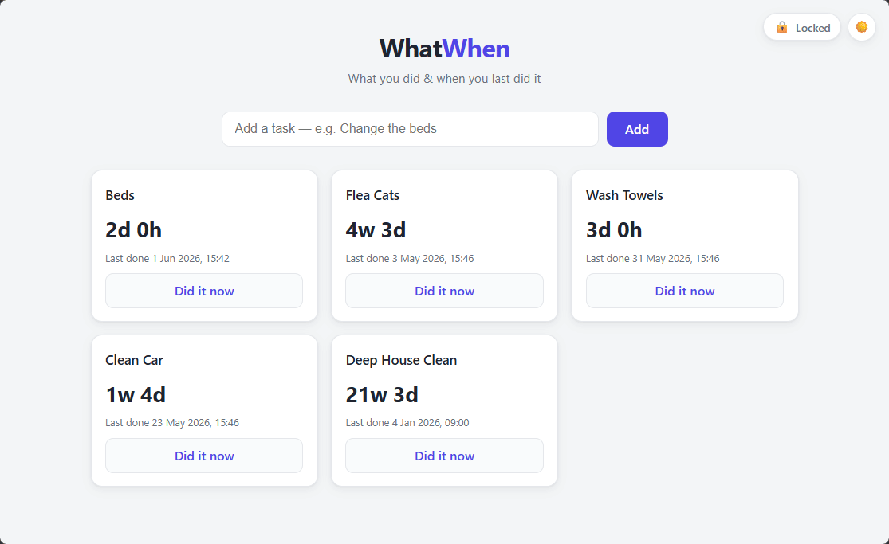

# WhatWhen

A tiny, self-hosted web app to track **what** you did and **when** you last did it.

Changed the beds? Washed the towels? Flea-treated the cat? Make a button for it. Each button
shows a live timer counting up since you last pressed it. No rigid schedules, no reminders —
just an honest answer to *"when did we last do that?"*

- **Minimal & lightweight** — a single static Go binary on a `scratch` image (a few MB), no
  runtime dependencies.
- **No database** — data lives in one human-readable JSON file on a mounted volume, and survives
  reboots and container recreation.
- **No login** — designed to run locally or behind a reverse proxy (e.g. nginx proxy manager).
- **Always counting** — timers are anchored to a stored timestamp, so they stay correct whether
  or not the page (or server) was running.




## Run with Docker

Docker Compose

```bash
services:
  whatwhen:
    image: ghcr.io/markmork/whatwhen:latest
    restart: unless-stopped
    ports:
      - "8080:8080"
```

Then open <http://localhost:8080>. Data is stored in the named volume `whatwhen-data`
(`/data/whatwhen.json` inside the container) and persists across restarts and image updates.

To update to the latest image: `docker compose pull && docker compose up -d`.

### Plain Docker (without compose)

```bash
docker run -d --name whatwhen -p 8080:8080 -v whatwhen-data:/data ghcr.io/markmork/whatwhen:latest
```

## Configuration

| Variable    | Default                | Description                          |
|-------------|------------------------|--------------------------------------|
| `PORT`      | `8080`                 | Port the server listens on.          |
| `DATA_FILE` | `/data/whatwhen.json`  | Path to the JSON data file.          |

## How it works

The server stores each item as `{ id, label, createdAt, lastReset }` and only deals in
timestamps — the browser computes and ticks the elapsed time once per second. Pressing
**"Did it now"** sets `lastReset` to the current time.

### API

| Method | Path                      | Description            |
|--------|---------------------------|------------------------|
| GET    | `/api/items`              | List all items         |
| POST   | `/api/items`              | Create `{ "label" }`   |
| PATCH  | `/api/items/{id}`         | Rename `{ "label" }`   |
| POST   | `/api/items/{id}/reset`   | Mark as done now       |
| DELETE | `/api/items/{id}`         | Delete an item         |

## License

MIT
